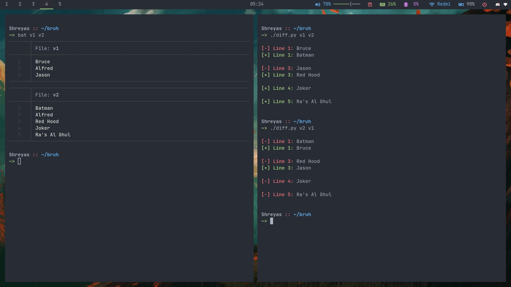

# Diff Utility
<p align="center">

## 🛠️ Description

A Diff Utility that takes in two file names as commandline arguments and compares them. The comparison is then shown as the output indication which file has changed where.

## ⚙️ Languages or Frameworks Used
You need Python to run this script. You can visit [here](https://www.python.org/downloads/) to download Python.
You also need ``rich`` package installed. Install it via the terminal.
```sh
pip install rich
```

## 🌟 How to run

Running the script is really simple! Just open a terminal in the folder where your script is located and run the following command:

```sh
python diff.py <file1.txt> <file2.txt>
```

## 📺 Demo
<p align="center">


